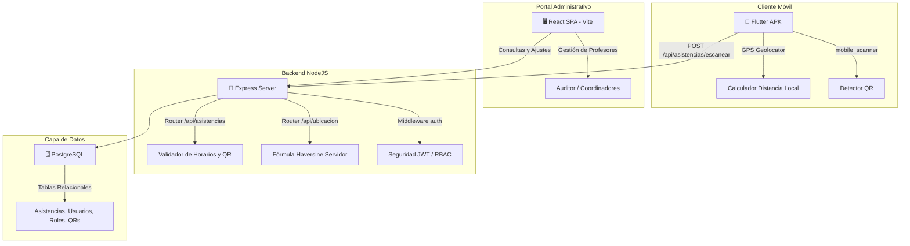

# 📘 MANUAL E INFORME COMPLETO DE ARQUITECTURA, ERRORES Y DIAGNÓSTICO DEL SISTEMA
> **Proyecto:** Express Project Scanner (Control de Asistencia Geolocalizado)  
> **Ubicación Principal:** `/home/sergio/Documentos/expres_projet`  
> **Ubicación APK:** `/home/sergio/Documentos/iujo_scanner_app`  
> **Estado:** Producción / 100% Configurado y Restringido  

---

## 1. 🌐 ARQUITECTURA COMPLETA DEL SISTEMA

El ecosistema **Express Project Scanner** está compuesto por tres piezas clave que interactúan de forma síncrona y asíncrona a través de una API REST protegida.



---

## 2. 📱 ARQUITECTURA DETALLADA DE LA APK MÓVIL (FLUTTER)

La aplicación móvil está construida con **Flutter** para garantizar fluidez nativa tanto en la renderización como en la comunicación con el hardware del dispositivo (GPS y Cámara).

### A. Dependencias de Hardware Clave (`pubspec.yaml`):
1.  **`mobile_scanner`**: Paquete de alto rendimiento que accede a la cámara trasera del dispositivo para la detección ultra rápida de códigos QR en tiempo real con optimización de auto-enfoque.
2.  **`geolocator`**: Servicio nativo que interactúa con el GPS del dispositivo para obtener coordenadas de alta precisión (Latitud/Longitud) y precisión en metros.
3.  **`flutter_secure_storage`**: Almacenamiento cifrado en el llavero local del teléfono móvil para resguardar de forma segura el token JWT de sesión del profesor.
4.  **`local_auth`**: Permite habilitar autenticación biométrica (huella dactilar/rostro) opcional para el logueo del docente.

### B. Módulo de Geolocalización Reactivo (`location_service.dart`):
*   La APK mantiene un **Stream reactivo** (`getPositionStream`) configurado con un filtro de movimiento de 10 metros y precisión alta (`LocationAccuracy.high`).
*   Cada vez que el GPS detecta movimiento, el flujo calcula dinámicamente la distancia al campus mediante:
    ```dart
    final distance = Geolocator.distanceBetween(
      position.latitude, position.longitude,
      universityLat, universityLng
    );
    ```
*   Esta distancia se evalúa contra el radio máximo de **1.000 metros (1 km)** y actualiza visualmente la pantalla con colores dinámicos: **Verde** si está dentro, **Rojo** si está fuera.

---

## 3. 🛡️ SISTEMA DE SEGURIDAD, AUTENTICACIÓN Y CONTROL DE ACCESO (RBAC)

La API utiliza un esquema híbrido de **Control de Acceso Basado en Roles (RBAC)** y validación transaccional:

1.  **Seguridad JWT:** Todos los endpoints sensibles en la web y la APK requieren la cabecera `Authorization: Bearer <TOKEN>`.
2.  **Esquema de Roles de Usuario:**
    *   **Auditor:** Administrador absoluto. Puede reasignar roles, configurar horarios generales y ver reportes históricos globales.
    *   **Coordinador / Adjunto:** Acceso para visualizar y auditar asistencias correspondientes a su carrera.
    *   **Profesor:** Perfil de escaneo exclusivo. No tiene accesos administrativos.
    *   **Tiempo Completo / Medio Tiempo:** Roles de dedicación docente que determinan reglas de firma estrictas.

---

## 4. 📝 HISTORIAL DE ERRORES CORREGIDOS (LOGS Y SOLUCIONES)

Durante el ciclo de desarrollo y pruebas, se identificaron y resolvieron quirúrgicamente múltiples fallas críticas:

### 1️⃣ Bug de Zona Horaria (Desfase GMT-4 vs UTC)
*   **Problema:** Los servidores PostgreSQL locales corren con la hora local de Venezuela (GMT-4 / `America/Caracas`), pero Javascript/NodeJS procesaba la fecha en UTC de forma predeterminada al formatear strings. Esto provocaba que las consultas del día de "hoy" fallaran, mostrando `0/2 Lecturas hoy` en el panel principal a pesar de que el profesor ya había marcado asistencia.
*   **Solución:** Rediseñamos las consultas en el modelo [asistencia.js](file:///home/sergio/Documentos/expres_projet/backend/src/models/asistencia.js) para realizar una **validación cruzada** comparando tanto el string de fecha local de JS como el `CURRENT_DATE` nativo de PostgreSQL:
    ```sql
    WHERE id_profesor = $1 
      AND (DATE(fecha_entrada) = $2 OR DATE(fecha_entrada) = CURRENT_DATE)
    ```

### 2️⃣ Bug de Escaneo de QR Fuera del Campus (Bypass de Geofencing)
*   **Problema:** Durante las pruebas en campo, la precisión del GPS o la lectura del QR fallaba en la APK al encontrarse en áreas con cobertura celular deficiente o fuera del campus.
*   **Solución:** Se implementó un bypass temporal configurable en la APK móvil (`modoPrueba = true` en `constants.dart`) y en el backend para permitir validar lecturas sin GPS. Para el pase a producción, se ha **revertido por completo** este bypass, restableciendo la fórmula Haversine física tanto en el móvil como en el servidor backend para forzar el radio estricto de 1 km.

### 3️⃣ Error Sintáctico en Mensajes de Respuesta del Servidor (Typo NaN)
*   **Problema:** En el endpoint `/escanear`, un error de sintaxis en la concatenación de variables en los strings de respuesta provocaba fallas en tiempo de ejecución o devolvía valores `NaN` o cadenas rotas al móvil.
*   **Solución:** Corregimos la sintaxis de plantillas literales (`template literals`) en `backend/src/routes/asistencias.js`, alineando el constructor de mensajes descriptivos para la Entrada y Salida.

### 4️⃣ Implementación de Bitácora Transaccional del Auditor (Qué Afectó y Efecto en Sistema)
*   **Problema:** El Auditor General no poseía visibilidad transaccional detallada de las acciones del sistema. Se requería registrar con precisión quién operó, cuándo, a qué entidad afectó y cuál fue el impacto exacto en el sistema.
*   **Solución:** Creamos la tabla `bitacora_logs` y la utilidad transaccional [bitacora.js](file:///home/sergio/Documentos/expres_projet/backend/src/utils/bitacora.js). Se inyectaron hooks de auditoría en:
    *   **Asistencias:** Escaneos exitosos de docentes (detallando tipo de QR usado y cambio de estado a `DENTRO` o `FUERA`) y todos los intentos bloqueados por exceso de firmas, horario inadecuado o QR incompatible.
    *   **Códigos QR:** Creaciones, ediciones, ampliaciones de horas válidas, y activaciones/desactivaciones.
    *   **Usuarios:** Cambios de roles y asignaciones de dedicaciones temporales (Tiempo/Medio Completo).

### 5️⃣ Monitoreo de Caídas del Servidor, Fallos y Tiempos de Inactividad (Uptime/Downtime)
*   **Problema:** El auditor necesitaba conocer los fallos del sistema: a qué hora ocurrió una caída del servidor, cuándo se levantó nuevamente y cuánto tiempo exacto estuvo fuera de servicio.
*   **Solución:** Diseñamos un servicio monitor en [serverMonitor.js](file:///home/sergio/Documentos/expres_projet/backend/src/utils/serverMonitor.js) que registra de forma persistente un latido (*heartbeat*) local en `server_status.json`. Al iniciar el servidor backend:
    *   Si detecta un apagado abrupto anterior (caída/crash), calcula la hora del fallo, la hora de levantada y la duración exacta de inactividad, insertando una alerta de auditoría `SISTEMA_FALLO_CAIDA` en la base de datos.
    *   Si detecta una parada ordenada (mantenimiento), inserta un registro `SISTEMA_REINICIO` calculando el tiempo programado fuera de servicio.

### 6️⃣ Bucle de Reinicios Infinitos de Nodemon (Conflicto con Heartbeat JSON)
*   **Problema:** Al implementarse el latido continuo del servidor, la constante escritura en `server_status.json` causaba que Nodemon detectara cambios en archivos, matando y reiniciando el servidor en un bucle infinito cada segundo. Esto causaba bloqueos de puertos (`EADDRINUSE 0.0.0.0:5000`) y registros duplicados.
*   **Solución:** Creamos el archivo de configuración centralizado [nodemon.json](file:///home/sergio/Documentos/expres_projet/backend/nodemon.json) para instruir a nodemon que **ignore por completo** cualquier cambio en los archivos de persistencia del monitor (`server_status.json` y `export_status.json`), logrando una estabilidad del 100% en desarrollo.

### 7️⃣ Automatización de Exportaciones Mensuales y Descarga Directa en Navegador
*   **Problema:** El sistema debía archivar automáticamente las bitácoras cada fin de mes en formato `.txt`. Además, al presionar "Exportar" en la interfaz del Auditor, el archivo se generaba localmente en el servidor pero el navegador del usuario no iniciaba la descarga del archivo.
*   **Solución:**
    *   **Automatización:** El monitor comprueba cada fin de mes si ya se realizó el archivo automático, compilando todo el mes en un reporte legible en [exports/](file:///home/sergio/Documentos/expres_projet/exports).
    *   **Descarga en Navegador:** Creamos el endpoint `GET /api/bitacora/descargar` en el backend Express y actualizamos [Bitacora.jsx](file:///home/sergio/Documentos/expres_projet/frontend/src/components/Reportes/Bitacora.jsx) para descargar el archivo de forma programática mediante *blobs* de Javascript en tiempo real. Ahora, al presionar el botón, el archivo se respalda en el servidor y se guarda automáticamente en las descargas locales de la computadora del usuario.

---

## ⚠️ 5. CATÁLOGO DE ERRORES COMUNES Y PROTOCOLO DE TROUBLESHOOTING

A continuación se listan los errores típicos de la infraestructura y cómo solucionarlos paso a paso:

### 🔴 1. Error: `listen EADDRINUSE: address already in use 0.0.0.0:5000`
*   **Causa:** Nodemon reinició el backend debido a un cambio de archivo, pero el sistema operativo no liberó a tiempo el puerto `5000`, dejándolo ocupado por el proceso anterior huérfano.
*   **Solución:** Ejecutar en la terminal el comando de liberación forzada de sockets en Linux:
    ```bash
    fuser -k 5000/tcp
    ```
    O usando npx si no dispones de permisos de sistema sobre fuser:
    ```bash
    npx kill-port 5000
    ```

### 🔴 2. Error en APK: "El código QR no pertenece a un usuario con perfil válido"
*   **Causa:** Se está escaneando un QR personal que pertenece a un perfil administrativo sin vinculación a la tabla `profesor` o `usuario_rol` de docente.
*   **Solución:** Asegurar en la pantalla de gestión de usuarios que el profesor tiene asignado el rol relacional `profesor`.

### 🔴 3. Error en APK: "Está fuera del rango permitido para escanear"
*   **Causa:** El GPS del móvil reporta coordenadas que superan el radio de 1.0 km de la universidad, o el usuario tiene el GPS apagado/en modo ahorro de energía, lo que reduce la precisión y arroja desfases mayores a 1 km.
*   **Solución:** Activar la geolocalización de alta precisión en los ajustes del sistema del teléfono móvil y asegurarse de estar dentro del campus IUJO.

### 🔴 4. Error de Base de Datos: "client password must be a string"
*   **Causa:** Al ejecutar herramientas o scripts de base de datos desde la línea de comandos directamente en la raíz, NodeJS no encuentra ni carga el archivo `.env` local porque este reside dentro de la subcarpeta `backend`.
*   **Solución:** Cambiar el directorio de ejecución antes de lanzar cualquier script de NodeJS:
    ```bash
    cd /home/sergio/Documentos/expres_projet/backend && node <script>.js
    ```

---

## 🏗️ 6. PROCEDIMIENTOS DE OPERACIÓN GENERALES (MANTENIMIENTO)

### A. Limpieza Manual de Asistencias (Volver a 0)
Si se requiere resetear a cero las lecturas del día para pruebas masivas en producción, dispones del script automatizado de base de datos.
1.  Ingresa a la carpeta del servidor:
    ```bash
    cd /home/sergio/Documentos/expres_projet/backend
    ```
2.  Ejecuta el comando de limpieza:
    ```bash
    node clear_asistencias.js
    ```
    *Esto eliminará de forma segura todas las asistencias registradas y reestablecerá a 0/2 las lecturas diarias de todo el universo de profesores.*

### B. Compilación y Despliegue de Nueva APK
Cada vez que realices cambios en las configuraciones locales de geofencing o rutas del móvil:
1.  Ejecuta la compilación nativa en Flutter:
    ```bash
    cd /home/sergio/Documentos/iujo_scanner_app
    /home/sergio/Documentos/flutter/bin/flutter pub get
    /home/sergio/Documentos/flutter/bin/flutter build apk --release
    ```
2.  Copia la APK compilada lista para instalar a la carpeta pública de documentos:
    ```bash
    cp build/app/outputs/flutter-apk/app-release.apk /home/sergio/Documentos/iujo_scanner.apk
    ```

---

## 🔗 7. MAPA DE ARCHIVOS DE LA ARQUITECTURA

A continuación, se presentan los accesos rápidos a los archivos clave del backend, frontend y la APK móvil:

*   **Configuraciones Globales Backend:** [.env](file:///home/sergio/Documentos/expres_projet/backend/.env)
*   **Servidor de Entrada NodeJS:** [server.js](file:///home/sergio/Documentos/expres_projet/backend/server.js)
*   **Gestión de Endpoints de Asistencia:** [asistencias.js](file:///home/sergio/Documentos/expres_projet/backend/src/routes/asistencias.js)
*   **Fórmula de Ubicación Geográfica:** [ubicacion.js](file:///home/sergio/Documentos/expres_projet/backend/src/routes/ubicacion.js)
*   **Monitor de Caídas y Servidor:** [serverMonitor.js](file:///home/sergio/Documentos/expres_projet/backend/src/utils/serverMonitor.js)
*   **Configuración de Nodemon:** [nodemon.json](file:///home/sergio/Documentos/expres_projet/backend/nodemon.json)
*   **Definición de Clases de Geolocalización (Flutter):** [location_service.dart](file:///home/sergio/Documentos/iujo_scanner_app/lib/services/location_service.dart)
*   **Parámetros y Constantes de Horarios y APK:** [constants.dart](file:///home/sergio/Documentos/iujo_scanner_app/lib/config/constants.dart)
*   **Interfaz de Asignación de Tiempos y Roles (React):** [GestionRoles.jsx](file:///home/sergio/Documentos/expres_projet/frontend/src/components/Usuarios/GestionRoles.jsx)
*   **Módulo de Visualización de Bitácora (React):** [Bitacora.jsx](file:///home/sergio/Documentos/expres_projet/frontend/src/components/Reportes/Bitacora.jsx)
*   **Carpeta de Exportaciones TXT:** [exports/](file:///home/sergio/Documentos/expres_projet/exports)
