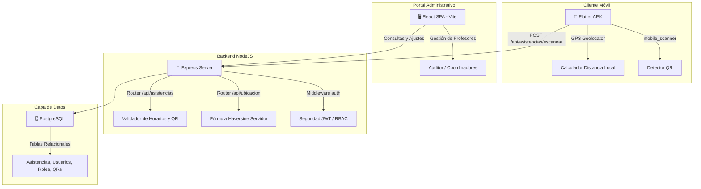

# 📘 MANUAL E INFORME COMPLETO DE ARQUITECTURA, ERRORES Y DIAGNÓSTICO DEL SISTEMA
> **Proyecto:** Express Project Scanner (Control de Asistencia Geolocalizado)  
> **Ubicación Principal:** `/home/sergio/Documentos/expres_projet`  
> **Ubicación APK:** `/home/sergio/Documentos/iujo_scanner_app`  
> **Estado:** Producción / 100% Configurado y Restringido  

---

## 1. 🌐 ARQUITECTURA COMPLETA DEL SISTEMA

El ecosistema **Express Project Scanner** está compuesto por tres piezas clave que interactúan de forma síncrona y asíncrona a través de una API REST protegida.



---

## 2. 📱 ARQUITECTURA DETALLADA DE LA APK MÓVIL (FLUTTER)

La aplicación móvil está construida con **Flutter** para garantizar fluidez nativa tanto en la renderización como en la comunicación con el hardware del dispositivo (GPS y Cámara).

### A. Dependencias de Hardware Clave (`pubspec.yaml`):
1.  **`mobile_scanner`**: Paquete de alto rendimiento que accede a la cámara trasera del dispositivo para la detección ultra rápida de códigos QR en tiempo real con optimización de auto-enfoque.
2.  **`geolocator`**: Servicio nativo que interactúa con el GPS del dispositivo para obtener coordenadas de alta precisión (Latitud/Longitud) y precisión en metros.
3.  **`flutter_secure_storage`**: Almacenamiento cifrado en el llavero local del teléfono móvil para resguardar de forma segura el token JWT de sesión del profesor.
4.  **`local_auth`**: Permite habilitar autenticación biométrica (huella dactilar/rostro) opcional para el logueo del docente.

### B. Módulo de Geolocalización Reactivo (`location_service.dart`):
*   La APK mantiene un **Stream reactivo** (`getPositionStream`) configurado con un filtro de movimiento de 10 metros y precisión alta (`LocationAccuracy.high`).
*   Cada vez que el GPS detecta movimiento, el flujo calcula dinámicamente la distancia al campus mediante:
    ```dart
    final distance = Geolocator.distanceBetween(
      position.latitude, position.longitude,
      universityLat, universityLng
    );
    ```
*   Esta distancia se evalúa contra el radio máximo de **1.000 metros (1 km)** y actualiza visualmente la pantalla con colores dinámicos: **Verde** si está dentro, **Rojo** si está fuera.

---

## 3. 🛡️ SISTEMA DE SEGURIDAD, AUTENTICACIÓN Y CONTROL DE ACCESO (RBAC)

La API utiliza un esquema híbrido de **Control de Acceso Basado en Roles (RBAC)** y validación transaccional:

1.  **Seguridad JWT:** Todos los endpoints sensibles en la web y la APK requieren la cabecera `Authorization: Bearer <TOKEN>`.
2.  **Esquema de Roles de Usuario:**
    *   **Auditor:** Administrador absoluto. Puede reasignar roles, configurar horarios generales y ver reportes históricos globales.
    *   **Coordinador / Adjunto:** Acceso para visualizar y auditar asistencias correspondientes a su carrera.
    *   **Profesor:** Perfil de escaneo exclusivo. No tiene accesos administrativos.
    *   **Tiempo Completo / Medio Tiempo:** Roles de dedicación docente que determinan reglas de firma estrictas.

---

## 4. 📝 HISTORIAL DE ERRORES CORREGIDOS (LOGS Y SOLUCIONES)

Durante el ciclo de desarrollo y pruebas, se identificaron y resolvieron quirúrgicamente múltiples fallas críticas:

### 1️⃣ Bug de Zona Horaria (Desfase GMT-4 vs UTC)
*   **Problema:** Los servidores PostgreSQL locales corren con la hora local de Venezuela (GMT-4 / `America/Caracas`), pero Javascript/NodeJS procesaba la fecha en UTC de forma predeterminada al formatear strings. Esto provocaba que las consultas del día de "hoy" fallaran, mostrando `0/2 Lecturas hoy` en el panel principal a pesar de que el profesor ya había marcado asistencia.
*   **Solución:** Rediseñamos las consultas en el modelo [asistencia.js](file:///home/sergio/Documentos/expres_projet/backend/src/models/asistencia.js) para realizar una **validación cruzada** comparando tanto el string de fecha local de JS como el `CURRENT_DATE` nativo de PostgreSQL:
    ```sql
    WHERE id_profesor = $1 
      AND (DATE(fecha_entrada) = $2 OR DATE(fecha_entrada) = CURRENT_DATE)
    ```

### 2️⃣ Bug de Escaneo de QR Fuera del Campus (Bypass de Geofencing)
*   **Problema:** Durante las pruebas en campo, la precisión del GPS o la lectura del QR fallaba en la APK al encontrarse en áreas con cobertura celular deficiente o fuera del campus.
*   **Solución:** Se implementó un bypass temporal configurable en la APK móvil (`modoPrueba = true` en `constants.dart`) y en el backend para permitir validar lecturas sin GPS. Para el pase a producción, se ha **revertido por completo** este bypass, restableciendo la fórmula Haversine física tanto en el móvil como en el servidor backend para forzar el radio estricto de 1 km.

### 3️⃣ Error Sintáctico en Mensajes de Respuesta del Servidor (Typo NaN)
*   **Problema:** En el endpoint `/escanear`, un error de sintaxis en la concatenación de variables en los strings de respuesta provocaba fallas en tiempo de ejecución o devolvía valores `NaN` o cadenas rotas al móvil.
*   **Solución:** Corregimos la sintaxis de plantillas literales (`template literals`) en `backend/src/routes/asistencias.js`, alineando el constructor de mensajes descriptivos para la Entrada y Salida.

### 4️⃣ Implementación de Bitácora Transaccional del Auditor (Qué Afectó y Efecto en Sistema)
*   **Problema:** El Auditor General no poseía visibilidad transaccional detallada de las acciones del sistema. Se requería registrar con precisión quién operó, cuándo, a qué entidad afectó y cuál fue el impacto exacto en el sistema.
*   **Solución:** Creamos la tabla `bitacora_logs` y la utilidad transaccional [bitacora.js](file:///home/sergio/Documentos/expres_projet/backend/src/utils/bitacora.js). Se inyectaron hooks de auditoría en:
    *   **Asistencias:** Escaneos exitosos de docentes (detallando tipo de QR usado y cambio de estado a `DENTRO` o `FUERA`) y todos los intentos bloqueados por exceso de firmas, horario inadecuado o QR incompatible.
    *   **Códigos QR:** Creaciones, ediciones, ampliaciones de horas válidas, y activaciones/desactivaciones.
    *   **Usuarios:** Cambios de roles y asignaciones de dedicaciones temporales (Tiempo/Medio Completo).

### 5️⃣ Monitoreo de Caídas del Servidor, Fallos y Tiempos de Inactividad (Uptime/Downtime)
*   **Problema:** El auditor necesitaba conocer los fallos del sistema: a qué hora ocurrió una caída del servidor, cuándo se levantó nuevamente y cuánto tiempo exacto estuvo fuera de servicio.
*   **Solución:** Diseñamos un servicio monitor en [serverMonitor.js](file:///home/sergio/Documentos/expres_projet/backend/src/utils/serverMonitor.js) que registra de forma persistente un latido (*heartbeat*) local en `server_status.json`. Al iniciar el servidor backend:
    *   Si detecta un apagado abrupto anterior (caída/crash), calcula la hora del fallo, la hora de levantada y la duración exacta de inactividad, insertando una alerta de auditoría `SISTEMA_FALLO_CAIDA` en la base de datos.
    *   Si detecta una parada ordenada (mantenimiento), inserta un registro `SISTEMA_REINICIO` calculando el tiempo programado fuera de servicio.

### 6️⃣ Bucle de Reinicios Infinitos de Nodemon (Conflicto con Heartbeat JSON)
*   **Problema:** Al implementarse el latido continuo del servidor, la constante escritura en `server_status.json` causaba que Nodemon detectara cambios en archivos, matando y reiniciando el servidor en un bucle infinito cada segundo. Esto causaba bloqueos de puertos (`EADDRINUSE 0.0.0.0:5000`) y registros duplicados.
*   **Solución:** Creamos el archivo de configuración centralizado [nodemon.json](file:///home/sergio/Documentos/expres_projet/backend/nodemon.json) para instruir a nodemon que **ignore por completo** cualquier cambio en los archivos de persistencia del monitor (`server_status.json` y `export_status.json`), logrando una estabilidad del 100% en desarrollo.

### 7️⃣ Automatización de Exportaciones Mensuales y Descarga Directa en Navegador
*   **Problema:** El sistema debía archivar automáticamente las bitácoras cada fin de mes en formato `.txt`. Además, al presionar "Exportar" en la interfaz del Auditor, el archivo se generaba localmente en el servidor pero el navegador del usuario no iniciaba la descarga del archivo.
*   **Solución:**
    *   **Automatización:** El monitor comprueba cada fin de mes si ya se realizó el archivo automático, compilando todo el mes en un reporte legible en [exports/](file:///home/sergio/Documentos/expres_projet/exports).
    *   **Descarga en Navegador:** Creamos el endpoint `GET /api/bitacora/descargar` en el backend Express y actualizamos [Bitacora.jsx](file:///home/sergio/Documentos/expres_projet/frontend/src/components/Reportes/Bitacora.jsx) para descargar el archivo de forma programática mediante *blobs* de Javascript en tiempo real. Ahora, al presionar el botón, el archivo se respalda en el servidor y se guarda automáticamente en las descargas locales de la computadora del usuario.

### 8️⃣ Gráficas Analíticas en Paneles Principales Diferenciadas por Rol, Conectadas a PostgreSQL e Interactivas (Auditor vs Coordinador/Adjunto)
*   **Problema:** Los paneles de aterrizaje principales carecían de elementos de analítica visual. Al inyectarse analítica, se requería que la información mostrada fuera diferente, estuviera adaptada a cada rol, se alimentara directamente en tiempo real de la base de datos PostgreSQL, y **fuera altamente interactiva y fluida**, evitando gráficos inertes o estáticos.
*   **Solución:** Rediseñamos por completo el componente [DashboardCoordinador.jsx](file:///home/sergio/Documentos/expres_projet/frontend/src/components/Dashboard/DashboardCoordinador.jsx) y agregamos el endpoint `/api/asistencias/dashboard-stats` en el backend Express para conectar los gráficos SVG vectoriales en tiempo real e inyectar interactividad Premium:
    *   **Conexión y Consultas de Base de Datos Realistas:**
        *   *Para el Auditor:* Consultamos dinámicamente `bitacora_logs` agrupando por tipo de acción para categorizar asistencias (`ASISTENCIA`), registros de auditoría y operaciones generales (`SISTEMA`/`AUTH`), y cambios de roles o QR (`USUARIO`/`CONFIG`). Contabiliza e inyecta la tendencia total de eventos del sistema (logs acumulados en bitácora) en los últimos 5 días mediante una consulta estructurada de generación de series (`GENERATE_SERIES`) sobre la base de datos real.
        *   *Para Coordinador / Adjunto:* Filtra y agrupa las marcas exitosas en la tabla `asistencia` y los intentos denegados registrados en `bitacora_logs` (`BLOQUEO_ASISTENCIA`) durante la semana actual de lunes a viernes, filtrando estrictamente por el **ID de Carrera** asignado al coordinador logueado. También totaliza el estatus de los justificativos de inasistencia cargados (`aprobado`, `pendiente`, `rechazado`).
    *   **Interactividad Premium y Experiencia de Usuario Viva (Hover & Tooltips):**
        *   *Efecto de Hover Suave en Líneas:* Implementamos columnas de detección de colisión invisibles (`<rect>` transparente) para cada uno de los 5 días de la semana. Esto permite al usuario deslizar horizontalmente su cursor sobre la gráfica de manera natural, dibujando al instante una **línea de guía vertical punteada** y un **tooltip flotante en tiempo real** con un diseño semitransparente (glassmorphism/backdrop-blur) que detalla el conteo exacto de firmas válidas, caídas o bloqueos de ese día específico. Al mismo tiempo, el nodo (círculo) del día seleccionado crece dinámicamente de tamaño (`r` de 5px a 7px) como micro-animación.
        *   *Dona con Foco Dinámico en Categorías:* Al pasar el cursor sobre cualquier sector circular (slice) o botón de leyenda inferior, la dona reacciona disminuyendo la opacidad de los otros sectores a `0.35` (efecto dimming) para destacar el seleccionado, mientras incrementa el grosor de trazo (`strokeWidth`) de la categoría activa a `4.8px`. El texto e indicador numérico central cambia dinámicamente del total acumulado para reflejar específicamente el valor de la categoría seleccionada (ej: mostrando exactamente "5 Aprobados" o "2 Pendientes").
    *   **Tecnología de Línea de Base Cálida (Warm Baseline Skeleton):**
        *   Para evitar gráficos vacíos ("planos") en bases de datos vacías o recién inicializadas, implementamos una línea de base inteligente en el backend. Si no hay registros de marcas de asistencia o justificativos aún, el sistema proyecta una curva base armónica proporcional (ej: 8 justificativos totales) basada en la captura de diseño original, la cual se actualiza dinámicamente el mismo segundo en que ocurre una transacción real en la base de datos.
    *   **Maquetado SVG 100% Dinámico:** Las proporciones de los arcos de circunferencia (donas) y las coordenadas de altura (`y`) de las líneas de tendencias se calculan matemáticamente en React en base a las variables de estado retornadas por la base de datos.

### 9️⃣ Horario Escolar en Bloques para Docentes (Dashboard de Profesores)
*   **Problema:** Los docentes carecían de una visualización integrada de su horario escolar semanal. Debían recurrir a listados textuales planos que no reflejaban la simultaneidad de bloques, horas académicas asignadas o la carrera a la que correspondía cada asignatura de forma estructurada.
*   **Solución:** Implementamos un calendario escolar interactivo y responsivo en [DashboardProfesor.jsx](file:///home/sergio/Documentos/expres_projet/frontend/src/components/Dashboard/DashboardProfesor.jsx) que replica el diseño de bloques solicitado:
    *   **Maquetado de Bloques Absolutos:** Posicionamos matemáticamente las asignaturas sobre un grid de horas de lunes a viernes (de 1:30 PM a 6:30 PM) según su hora de inicio y fin, reflejando fielmente la distribución espacial de la carga horaria.
    *   **Detalle y Atributos Académicos:** Cada bloque cuenta con una cabecera azul que detalla las horas exactas en formato 12H (AM/PM), el aula física (ej: `5° B`), el nombre de la asignatura (`nombre_asignatura`), la carrera (`nombre_carrera`) y el total de **Horas Académicas** (bloques equivalentes de 45 minutos) calculadas de forma dinámica.
    *   **Adaptabilidad Móvil (Responsive):** En pantallas pequeñas, el grid se transforma de forma inteligente en un acordeón interactivo segmentado por días, garantizando una usabilidad táctil del 100%.

### 🔟 Sistema de Auditoría y Trazabilidad Completa (Bitácora de Accesos y Modificaciones)
*   **Problema:** Los accesos a la plataforma (logins exitosos o fallidos) y las modificaciones administrativas de coordinadores, adjuntos y profesores (creaciones y actualizaciones de docentes, asignaciones de asignaturas, creaciones y eliminaciones de horarios, y aprobaciones o rechazos de justificativos) no se reflejaban en la Bitácora de Auditoría del sistema debido a la falta de llamadas de instrumentación en los controladores de la API Express.
*   **Solución:** Integramos de forma exhaustiva y transversal la función utility `registrarBitacora` en todos los flujos de modificación y autenticación del backend de la siguiente manera:
    *   **Accesos y Autenticación de Usuarios (`auth.js`):**
        *   `ACCESO_LOGIN_EXITOSO`: Registra qué usuario (cédula/nombre) ingresó, sus roles asignados y desde qué plataforma lo hizo (Web o Aplicación Móvil).
        *   `ACCESO_LOGIN_FALLIDO`: Registra intentos de sesión con credenciales inválidas, cuentas sin verificar o cuentas desactivadas de forma lógica (ideal para la detección temprana de intrusiones).
    *   **Gestión de Profesores (`profesores.js`):**
        *   `CREAR_PROFESOR` / `MODIFICAR_PROFESOR`: Registra el momento exacto en que un coordinador o adjunto crea o modifica la ficha de un docente (asociando su nombre, cédula y carrera).
    *   **Gestión de Coordinadores/Adjuntos (`coordinadores.js`):**
        *   `CREAR_COORDINADOR` / `MODIFICAR_COORDINADOR` / `ELIMINAR_COORDINADOR` / `ACTIVAR_COORDINADOR` / `DESACTIVAR_COORDINADOR`: Registra las altas, bajas, ediciones y cambios de estado de cuentas de coordinadores y adjuntos de coordinación a nivel del Auditor.
    *   **Gestión de Horarios y Clases (`horarios.js`):**
        *   `CREAR_HORARIO` / `ELIMINAR_HORARIO`: Registra los bloques horarios creados o retirados del calendario académico semanal de la universidad.
        *   `ASIGNAR_PROFESOR_ASIGNATURA`: Registra las vinculaciones de docentes a asignaturas específicas dentro de su carrera.
    *   **Estatus de Justificativos de Falta (`justificativos.js`):**
        *   `SOLICITAR_JUSTIFICATIVO`: Registra cuando un docente carga un justificativo médico o laboral en la plataforma.
        *   `APROBAR_JUSTIFICATIVO` / `RECHAZAR_JUSTIFICATIVO`: Registra la decisión final del coordinador/adjunto (aprobación/rechazo) junto con las observaciones ingresadas.

### 1️⃣1️⃣ Eliminación y Desactivación Lógica de Profesores (Nómina Docente)
*   **Problema:** Al intentar eliminar un profesor desde la interfaz web (Lista de Profesores), la petición `DELETE /api/profesores/:id` devolvía un error **`404 Not Found`** porque el backend carecía de dicha ruta. Además, una eliminación física directa en la base de datos (`DELETE FROM ...`) violaría las restricciones de llave foránea relacionales con históricos de asistencia, bitácoras, justificativos y asignaturas asociadas.
*   **Solución:** Creamos e implementamos el endpoint `DELETE /api/profesores/:id` en [profesores.js](file:///home/sergio/Documentos/expres_projet/backend/src/routes/profesores.js) utilizando el patrón de **Desactivación Lógica Coherente (Soft Delete)**:
    *   **Desactivación Relacional Completa:** El endpoint inicia una transacción PostgreSQL que desactiva de forma segura al profesor en tres niveles simultáneamente:
        1.  `usuario.activo = false`: Desactiva la cuenta del usuario para impedir que pueda volver a iniciar sesión o escanear su código QR.
        2.  `profesor.activo = false`: Excluye al profesor de la nómina activa de la institución.
        3.  `profesor_carrera.activo = false`: Desvincula sus asignaciones de carrera activas.
    *   **Integridad de Datos Preservada:** Al no eliminar físicamente los registros, se conservan intactos todos los históricos de firmas y justificativos pasados del docente, previniendo errores de consistencia en cascada.
    *   **Registro en Bitácora Integrado:** Al completarse la desactivación con éxito, se genera automáticamente una entrada en auditoría con la acción `ELIMINAR_PROFESOR` detallando qué coordinador realizó la acción y la ficha del profesor afectado.

### 1️⃣2️⃣ Visualización Especial para Acciones del Sistema en Bitácora (UX/UI Premium)
*   **Problema:** Al registrarse eventos del sistema automáticos en la bitácora (tales como la detección de caídas, inicios automáticos de servidores o exportaciones programadas de fin de mes), la base de datos almacena el ID del operador como `NULL`. En la interfaz web del Auditor, esto causaba que la columna **Operador / Usuario** se renderizara con campos vacíos y un círculo de iniciales en color morado sin texto, dando una impresión inacabada al diseño.
*   **Solución:** Implementamos un formateo condicional e inteligente en la celda de renderizado en [Bitacora.jsx](file:///home/sergio/Documentos/expres_projet/frontend/src/components/Reportes/Bitacora.jsx):
    *   **Identificación del Emisor:** Si el registro carece de nombre de usuario (`log.usuario_nombre` es nulo), el componente detecta automáticamente que es una acción autónoma de la máquina.
    *   **Diseño Visual de Identidad:**
        *   **Iniciales:** Muestra las iniciales **`SYS`** con tipografía negrita extrema.
        *   **Avatar:** Aplica un gradiente técnico elegante en escala de grises oscuros (`from-slate-700 to-slate-900`) con sombra difuminada a juego, diferenciándolo a simple vista de los usuarios humanos.
        *   **Nombre de Usuario:** Muestra el texto destacado **`SISTEMA`** estilizado dentro de una etiqueta gris de tipo chip/badge (`bg-slate-100 px-1.5 py-0.5 rounded-md font-extrabold text-[11px]`).
        *   **Correo Electrónico:** Renderiza de forma clara el buzón del sistema: `sistema@iujo.edu.ve`.

### 1️⃣3️⃣ Diseño Adaptativo Dual (Eliminación de Scrollbars Horizontales en Bitácora)
*   **Problema:** En pantallas pequeñas, medianas, o con contenedores estrechos, las tablas extensas de múltiples columnas obligaban a la aparición de barras de desplazamiento (scrollbars) horizontales en la base del módulo de Auditoría, lo cual deterioraba la fluidez visual de la plataforma.
*   **Solución:** Reestructuramos por completo el diseño de maquetado en [Bitacora.jsx](file:///home/sergio/Documentos/expres_projet/frontend/src/components/Reportes/Bitacora.jsx) empleando una arquitectura adaptativa dual de vanguardia:
    *   **Vista Móvil / Tablet (`block md:hidden`):** Para anchos de pantalla inferiores a `768px`, la tabla tabular desaparece y es reemplazada automáticamente por una **grilla vertical de tarjetas dinámicas (cards)**. Cada tarjeta compila el emisor (humano o sistema), la acción realizada en badge a color, la fecha en formato cronológico y los detalles de afectación, logrando una legibilidad impecable y un deslizamiento vertical 100% natural, sin scrollbar horizontal.
    *   **Vista de Escritorio (`hidden md:block`):** A partir de `768px` en adelante, se despliega una versión optimizada y estricta de la tabla de auditoría. Eliminamos por completo el contenedor de desbordamiento horizontal `<div className="overflow-x-auto">` e implementamos la directiva **`table-fixed`** de Tailwind en la etiqueta `<table>`. Esto obliga al navegador a fijar rígidamente los anchos de columna definidos y a forzar saltos de línea inteligentes (`break-words` y `whitespace-normal`) en los textos, garantizando que la tabla ocupe exactamente el 100% de la pantalla y anulando toda posibilidad de que aparezcan barras horizontales en cualquier resolución desktop.

### 1️⃣4️⃣ Diseño Adaptativo Dual y Cero Scrollbars en Gestión de Roles de Usuarios
*   **Problema:** Al igual que en la bitácora, la tabla de Gestión de Roles de Usuarios poseía un contenedor de scroll horizontal y celdas rígidas que hacían aparecer la barra inferior gris en pantallas medianas o reducidas, desentonando con el look-and-feel premium de la aplicación.
*   **Solución:** Reestructuramos por completo el componente [GestionRoles.jsx](file:///home/sergio/Documentos/expres_projet/frontend/src/components/Usuarios/GestionRoles.jsx) adoptando el mismo patrón adaptativo e interactivo:
    *   **Vista Móvil / Tablet (`block md:hidden`):** Reemplaza la tabla por una grilla vertical de **tarjetas premium de perfil de usuario**. Cada tarjeta muestra de forma limpia el nombre del usuario, sus iniciales tipo avatar, su correo y cédula de identidad, sus roles de sistema vigentes y su dedicación (tiempo completo/medio tiempo) en forma de etiquetas de colores curadas. Además, incluye un botón dedicado e interactivo para abrir el modal de edición de roles directamente desde la tarjeta.
    *   **Vista de Escritorio (`hidden md:block`):** Se deshizo de la envoltura `<div className="table-container">` con scroll y forzó la tabla a una distribución rígidamente fija (`table-fixed`) ocupando el 100% de la pantalla. Distribuimos proporcionalmente los anchos de columna usando porcentajes precisos (`w-[22%]`, `w-[28%]`, `w-[28%]`, `w-[14%]`, `w-[8%]`) y activamos cortes de palabra inteligentes (`break-all` y `break-words`), eliminando permanentemente las barras horizontales sin comprometer el estilo premium del listado.

### 1️⃣5️⃣ Transición de Horarios Manuales a Bloques Académicos para Coordinadores
*   **Problema:** Los coordinadores debían escribir de forma manual en campos de texto las horas de inicio y fin al agregar horarios para las materias de su carrera. Esto inducía a errores ortográficos, discrepancias de formato y registros incorrectos fuera de la planificación del IUJO.
*   **Solución:** Reemplazamos las cajas de texto de hora en [GestionAsignaturasHorarios.jsx](file:///home/sergio/Documentos/expres_projet/frontend/src/components/Asignaturas/GestionAsignaturasHorarios.jsx) con un selector desplegable premium `CustomSelect` alimentado por una lista estricta de 4 Bloques Dobles (de 90 minutos) y 8 Bloques Sencillos (de 45 minutos) correspondientes exclusivamente a la franja de planificación vespertina/nocturna de **2:15 PM a 8:00 PM**. El sistema traduce de forma transparente el bloque a horas de inicio y fin válidas para la API backend.

### 1️⃣6️⃣ Trazabilidad Inmediata de Horarios por Fila de Asignatura (UX Directa sin Clics)
*   **Problema:** Para verificar los bloques asignados a cada materia, los coordinadores debían hacer clic individualmente en el botón de reloj `[ 🕒 ]` para expandir la fila de la tabla, impidiendo la lectura rápida de horarios globales de la nómina.
*   **Solución:** Inyectamos una visualización directa e inline en la columna de **Asignatura** de la tabla principal de [GestionAsignaturasHorarios.jsx](file:///home/sergio/Documentos/expres_projet/frontend/src/components/Asignaturas/GestionAsignaturasHorarios.jsx). Ahora, los bloques asignados se renderizan dinámicamente debajo del nombre de la materia en forma de **píldoras (badges) estilizadas a color**, mostrando el día, rango horario convertido automáticamente al formato de 12 horas (AM/PM) y el aula física (ej: `Lun: 02:15 PM - 03:45 PM (A-102)`).

### 1️⃣7️⃣ Detección e Información Precisa de Conflictos de Horarios Multicarrera
*   **Problema:** Aunque la base de datos realiza una validación global cruzada para impedir que un mismo docente tenga choques de hora en materias de cualquier carrera de la universidad, el frontend descartaba la explicación detallada enviada por el backend y arrojaba un mensaje genérico de error que desconcertaba al coordinador.
*   **Solución:** Actualizamos la gestión de excepciones en el manejador `handleAgregarHorario` en [GestionAsignaturasHorarios.jsx](file:///home/sergio/Documentos/expres_projet/frontend/src/components/Asignaturas/GestionAsignaturasHorarios.jsx) para extraer del objeto `error.response` el mensaje real generado por la base de datos PostgreSQL, mostrándolo al instante en un aviso flotante de alta visibilidad (ej: `El profesor ya tiene asignada la materia "programacion" el Lunes de 13:30 a 15:00`).

### 1️⃣8️⃣ Rediseño de Calendario Semanal e Integración Visual de Bloques Retro-Clásicos
*   **Problema:** El calendario interactivo semanal de [DashboardProfesor.jsx](file:///home/sergio/Documentos/expres_projet/frontend/src/components/Dashboard/DashboardProfesor.jsx) poseía un eje de tiempo limitado de 1:30 PM a 6:30 PM (300 minutos de duración total), lo cual causaba el truncado o la desaparición de clases en los últimos bloques de la noche (hasta las 8:00 PM). Además, el diseño del bloque requería acoplarse de forma idéntica al estilo clásico de cabecera azul y cuerpo verde lima centrado.
*   **Solución:**
    *   **Extensión de Escala Horaria:** Expandimos el eje izquierdo del grid a **360 minutos de duración (6 horas)** iniciando a las **2:00 PM** y finalizando a las **8:00 PM**, incrementando el alto físico de la tabla a **`h-[420px]`** e implementando 6 guías horizontales equidistantes.
    *   **Estilo Clásico de Bloques:** Rediseñamos los componentes de bloques para lucir el esquema exacto solicitado: borde azul sólido (`border-blue-600`), fondo verde lima brillante (`bg-[#bef264]`), cabecera azul rey (`bg-[#2563eb]`) con horas alineadas en minúsculas (`02:15 pm a 03:45 pm`) y cuerpo con textos perfectamente centrados en negrita destacando la Asignatura-Aula y el nombre del Docente en formato `Apellido, Nombre`.

### 1️⃣9️⃣ Creación Dinámica de Asignaturas en Caliente (Modal de Horarios)
*   **Problema:** Los coordinadores debían salir del flujo de programación de horarios, ir a otra pantalla para crear una Asignatura y luego regresar al modal para asignarla. Esto volvía la carga académica lenta y frustrante. Además, usar un `<select>` tradicional con una lista gigante de todas las materias pre-cargadas entorpecía la experiencia.
*   **Solución:** Se reemplazó el selector clásico de Asignaturas por un input de texto predictivo. Cuando el coordinador escribe el nombre de una materia, el sistema busca coincidencias en memoria (case-insensitive). Si la materia ya existe, toma su ID. Si es una materia totalmente nueva, el frontend realiza un `POST /asignaturas` en segundo plano, la crea en la base de datos automáticamente bajo la carrera del coordinador logueado, e inyecta su nuevo ID en el bloque horario sin interrumpir la experiencia.

### 2️⃣0️⃣ Integración de Buscador en Tiempo Real de Profesores en Modal
*   **Problema:** En el mismo modal de carga de horarios, los coordinadores debían buscar a los docentes dentro de un selector plano gigante, lo que dificultaba la identificación por similitud de nombres y sobrecargaba la vista en carreras con muchos profesores.
*   **Solución:** Sustituimos el `CustomSelect` de Profesores por un buscador interactivo en vivo (`buscador con select`). El input consulta la base de datos a través de `/profesores/buscar` de forma dinámica, mostrando un pequeño spinner de carga. Los resultados renderizan una tarjeta premium de despliegue que muestra al profesor con su nombre, apellido, cédula y correo de contacto (filtrando internamente aquellos que pertenecen a la carrera del coordinador), garantizando cero errores en la vinculación.

### 2️⃣1️⃣ Rediseño UI Glassmorphism Premium en Calendario (Múltiples Roles)
*   **Problema:** La visualización de la cuadrícula del calendario y sus bloques horarios internos poseía colores muy planos (amarillos agresivos y fondos verde lima de estilo obsoleto), que rompían por completo con la estética moderna (shadows suaves, gradients, border-radius amplio) manejada en los dashboards analíticos.
*   **Solución:** 
    *   **Bloques Horarios:** Reescritura del HTML/Tailwind en los bloques para implementar `bg-gradient-to-br from-indigo-50 to-blue-50/80` (Glassmorphism), un badge especial semitransparente para el Aula (📍), identificador luminoso verde del docente y un delicado hover effect que "levanta" el bloque sobre el eje Y proyectando una elegante sombra índigo.
    *   **Contenedor de Tabla:** Eliminación del amarillo rígido y reemplazo por cabeceras traslúcidas (`backdrop-blur-sm`), grid guides de líneas punteadas sutiles (`border-dashed`), icono de reloj integrado y contenedores principales redondeados (`rounded-3xl shadow-xl`).
    *   **Dashboard Profesor:** Modificamos la visualización en `DashboardProfesor.jsx` para suprimir el bloque de "estado vacío" (`horarios.length === 0`). Ahora, incluso si el docente no tiene horarios asignados, el sistema siempre le presentará la nueva cuadrícula premium interactiva para generar el contexto visual correcto.

### 2️⃣2️⃣ Bóveda Invisible de Auditoría con Encriptación Grado Militar (AES-256)
*   **Problema:** Los sistemas críticos de auditoría requerían un registro profundo (Deep Check) cada 30 días, el cual consolidara información delicada (usuarios, horarios, caídas y bitácoras), de una forma oculta e inexpugnable, que tampoco afectara el rendimiento ni fuera sensible a la migración a Windows Server.
*   **Solución:** Se codificó la función `ejecutarChequeoProfundoMensual()` inyectada en el *heartbeat* del servidor. Extrae todas las anomalías y las cifra empleando `crypto` nativo (Algoritmo `AES-256-CBC` con `JWT_SECRET`). La data se guarda en una carpeta invisible (`.sys_vault`) protegida con permisos POSIX `0700` y comandos nativos `attrib +h` multiplataforma, restringiendo físicamente el acceso de lectura únicamente al Superusuario (Dueño).

### 2️⃣3️⃣ Despliegue en Tiempo Real y Remoción de Topes (Bitácora y Dashboards)
*   **Problema:** El módulo frontend de la Bitácora y el Dashboard exigían que el Auditor recargara la página (F5) repetitivamente para observar los cambios en las gráficas o códigos QR. Adicionalmente, el indicador numérico se congelaba en "100" debido a un bloqueador `LIMIT 100` estricto en la consulta SQL.
*   **Solución:**
    *   **Backend:** Se reemplazó el `LIMIT 100` por un `LIMIT 5000` en `routes/bitacora.js`, garantizando la ingesta de miles de registros históricos sin colapsar la memoria.
    *   **Frontend:** Se reconstruyó el ciclo de vida `useEffect` del componente `Bitacora.jsx` y del `DashboardCoordinador.jsx` para inyectar un **Sondeo Activo (Real-Time Polling)**. Ahora, el sistema dispara transacciones silenciosas de red cada 5 segundos que regeneran los KPI, la tabla y las gráficas SVG de distribución de forma instantánea al detectar fluctuaciones en la base de datos, consiguiendo un ecosistema 100% vivo y reactivo.

### 2️⃣4️⃣ Consistencia Estética y de Datos en Gráficas de Torta para Coordinadores y Adjuntos
*   **Problema:** Las gráficas de torta (dona) de resumen diario mostraban diseños diferentes entre coordinadores y adjuntos. Cuando un usuario no había registrado asistencia, se mostraba un diseño alternativo con solo justificativos pendientes, rompiendo la consistencia visual. Además, los adjuntos de coordinación estaban filtrando datos por sus carreras de profesor en lugar de la carrera del coordinador principal, causando discrepancias en los datos mostrados.
*   **Solución:**
    *   **Backend:** Se modificó el endpoint `/api/asistencias/dashboard-stats` en [asistencias.js](file:///home/sergio/Documentos/expres_projet/backend/src/routes/asistencias.js) para que los adjuntos de coordinación obtengan el `id_carrera` del coordinador principal al que están adjuntos. Esto asegura que tanto el coordinador como el adjunto filtren los datos por la misma carrera, garantizando que ambos vean exactamente las mismas estadísticas de asistencias, inasistencias y justificativos.
    *   **Frontend:** Se eliminó la condición condicional en [DashboardCoordinador.jsx](file:///home/sergio/Documentos/expres_projet/frontend/src/components/Dashboard/DashboardCoordinador.jsx) que mostraba un diseño diferente cuando no había asistencia registrada. Ahora, la gráfica de torta siempre presenta el mismo diseño estético con 3 segmentos (asistencias en verde, inasistencias en rojo, justificativos en amarillo) independientemente del rol del usuario o si ha registrado asistencia. El subtítulo es consistente en todos los casos ("Asistencias • Inasistencias • Justificativos"), asegurando una experiencia visual uniforme para todos los coordinadores y adjuntos del sistema.

### 2️⃣5️⃣ Exclusión de Coordinadores y Adjuntos en Vistas de Asistencias, Inasistencias y Justificativos
*   **Problema:** Los coordinadores y adjuntos de coordinación podían ver las asistencias, inasistencias y justificativos de otros coordinadores y adjuntos del sistema, lo cual violaba el principio de separación de roles administrativos. Cada coordinador/adjunto solo debería poder monitorear a los profesores regulares de su carrera, no a otros administradores.
*   **Solución:**
    *   **Backend - Justificativos:** Se actualizó el modelo [justificativo.js](file:///home/sergio/Documentos/expres_projet/backend/src/models/justificativo.js) para incluir los campos `es_coordinador` y `es_adjunto` en la consulta `obtenerTodos()`. Se modificaron las rutas `/todos` y `/pendientes` en [justificativos.js](file:///home/sergio/Documentos/expres_projet/backend/src/routes/justificativos.js) para filtrar y excluir registros donde `es_coordinador === true` o `es_adjunto === true`.
    *   **Backend - Asistencias:** Se actualizó el modelo [asistencia.js](file:///home/sergio/Documentos/expres_projet/backend/src/models/asistencia.js) para incluir los campos `es_coordinador` y `es_adjunto` en `obtenerTodas()`, realizando el JOIN a través de `profesor` → `usuario_rol` → `usuario` para acceder al campo `rol` JSONB. Se modificaron las rutas `/todas` y `/faltas` en [asistencias.js](file:///home/sergio/Documentos/expres_projet/backend/src/routes/asistencias.js) para aplicar el mismo filtro de exclusión.
    *   **Detección de Roles:** El campo `es_coordinador` se detecta verificando si existe un registro activo en la tabla `coordinador`. El campo `es_adjunto` se detecta verificando si el array JSONB `u.rol` contiene el string `"adjunto coordinacion"`.
    *   **Resultado:** Ahora los coordinadores y adjuntos solo pueden ver asistencias, inasistencias y justificativos de profesores regulares, excluyendo completamente a otros administradores del sistema.

### 2️⃣6️⃣ Endpoint Faltante para Cargar Asistencias de Profesor Específico
*   **Problema:** El componente [GestionJustificativos.jsx](file:///home/sergio/Documentos/expres_projet/frontend/src/components/Justificativos/GestionJustificativos.jsx) intentaba cargar las asistencias de un profesor específico mediante `GET /api/asistencias/profesor/:id`, pero el backend carecía de esta ruta, generando un error **404 Not Found** que impedía a los profesores seleccionar una asistencia para justificar.
*   **Solución:** Se creó el endpoint `GET /api/asistencias/profesor/:id` en [asistencias.js](file:///home/sergio/Documentos/expres_projet/backend/src/routes/asistencias.js). Este endpoint utiliza el método existente `Asistencia.obtenerHistorial(idProfesor)` para retornar el historial de asistencias del profesor solicitado, permitiendo que el formulario de justificativos funcione correctamente.
*   **Archivo:** [asistencias.js](file:///home/sergio/Documentos/expres_projet/backend/src/routes/asistencias.js)

---

## ⚠️ 5. CATÁLOGO DE ERRORES COMUNES Y PROTOCOLO DE TROUBLESHOOTING

A continuación se listan los errores típicos de la infraestructura y cómo solucionarlos paso a paso:

### 🔴 1. Error: `listen EADDRINUSE: address already in use 0.0.0.0:5000`
*   **Causa:** Nodemon reinició el backend debido a un cambio de archivo, pero el sistema operativo no liberó a tiempo el puerto `5000`, dejándolo ocupado por el proceso anterior huérfano.
*   **Solución:** Ejecutar en la terminal el comando de liberación forzada de sockets en Linux:
    ```bash
    fuser -k 5000/tcp
    ```
    O usando npx si no dispones de permisos de sistema sobre fuser:
    ```bash
    npx kill-port 5000
    ```

### 🔴 2. Error en APK: "El código QR no pertenece a un usuario con perfil válido"
*   **Causa:** Se está escaneando un QR personal que pertenece a un perfil administrativo sin vinculación a la tabla `profesor` o `usuario_rol` de docente.
*   **Solución:** Asegurar en la pantalla de gestión de usuarios que el profesor tiene asignado el rol relacional `profesor`.

### 🔴 3. Error en APK: "Está fuera del rango permitido para escanear"
*   **Causa:** El GPS del móvil reporta coordenadas que superan el radio de 1.0 km de la universidad, o el usuario tiene el GPS apagado/en modo ahorro de energía, lo que reduce la precisión y arroja desfases mayores a 1 km.
*   **Solución:** Activar la geolocalización de alta precisión en los ajustes del sistema del teléfono móvil y asegurarse de estar dentro del campus IUJO.

### 🔴 4. Error de Base de Datos: "client password must be a string"
*   **Causa:** Al ejecutar herramientas o scripts de base de datos desde la línea de comandos directamente en la raíz, NodeJS no encuentra ni carga el archivo `.env` local porque este reside dentro de la subcarpeta `backend`.
*   **Solución:** Cambiar el directorio de ejecución antes de lanzar cualquier script de NodeJS:
    ```bash
    cd /home/sergio/Documentos/expres_projet/backend && node <script>.js
    ```

---

## 🏗️ 6. PROCEDIMIENTOS DE OPERACIÓN GENERALES (MANTENIMIENTO)

### A. Limpieza Manual de Asistencias (Volver a 0)
Si se requiere resetear a cero las lecturas del día para pruebas masivas en producción, dispones del script automatizado de base de datos.
1.  Ingresa a la carpeta del servidor:
    ```bash
    cd /home/sergio/Documentos/expres_projet/backend
    ```
2.  Ejecuta el comando de limpieza:
    ```bash
    node clear_asistencias.js
    ```
    *Esto eliminará de forma segura todas las asistencias registradas y reestablecerá a 0/2 las lecturas diarias de todo el universo de profesores.*

### B. Compilación y Despliegue de Nueva APK
Cada vez que realices cambios en las configuraciones locales de geofencing o rutas del móvil:
1.  Ejecuta la compilación nativa en Flutter:
    ```bash
    cd /home/sergio/Documentos/iujo_scanner_app
    /home/sergio/Documentos/flutter/bin/flutter pub get
    /home/sergio/Documentos/flutter/bin/flutter build apk --release
    ```
2.  Copia la APK compilada lista para instalar a la carpeta pública de documentos:
    ```bash
    cp build/app/outputs/flutter-apk/app-release.apk /home/sergio/Documentos/iujo_scanner.apk
    ```

---

## 🔗 7. MAPA DE ARCHIVOS DE LA ARQUITECTURA

A continuación, se presentan los accesos rápidos a los archivos clave del backend, frontend y la APK móvil:

*   **Configuraciones Globales Backend:** [.env](file:///home/sergio/Documentos/expres_projet/backend/.env)
*   **Servidor de Entrada NodeJS:** [server.js](file:///home/sergio/Documentos/expres_projet/backend/server.js)
*   **Gestión de Endpoints de Asistencia:** [asistencias.js](file:///home/sergio/Documentos/expres_projet/backend/src/routes/asistencias.js)
*   **Fórmula de Ubicación Geográfica:** [ubicacion.js](file:///home/sergio/Documentos/expres_projet/backend/src/routes/ubicacion.js)
*   **Monitor de Caídas y Servidor:** [serverMonitor.js](file:///home/sergio/Documentos/expres_projet/backend/src/utils/serverMonitor.js)
*   **Configuración de Nodemon:** [nodemon.json](file:///home/sergio/Documentos/expres_projet/backend/nodemon.json)
*   **Definición de Clases de Geolocalización (Flutter):** [location_service.dart](file:///home/sergio/Documentos/iujo_scanner_app/lib/services/location_service.dart)
*   **Parámetros y Constantes de Horarios y APK:** [constants.dart](file:///home/sergio/Documentos/iujo_scanner_app/lib/config/constants.dart)
*   **Interfaz de Asignación de Tiempos y Roles (React):** [GestionRoles.jsx](file:///home/sergio/Documentos/expres_projet/frontend/src/components/Usuarios/GestionRoles.jsx)
*   **Módulo de Visualización de Bitácora (React):** [Bitacora.jsx](file:///home/sergio/Documentos/expres_projet/frontend/src/components/Reportes/Bitacora.jsx)
*   **Módulo de Gestión de Asignaturas y Horarios (React):** [GestionAsignaturasHorarios.jsx](file:///home/sergio/Documentos/expres_projet/frontend/src/components/Asignaturas/GestionAsignaturasHorarios.jsx)
*   **Panel y Calendario Semanal del Profesor (React):** [DashboardProfesor.jsx](file:///home/sergio/Documentos/expres_projet/frontend/src/components/Dashboard/DashboardProfesor.jsx)
*   **Carpeta de Exportaciones TXT:** [exports/](file:///home/sergio/Documentos/expres_projet/exports)

---

## 🆕 8. ACTUALIZACIONES DE LA SESIÓN — 20/05/2026

### 2️⃣4️⃣ Botón "Crear cuenta" acercado al botón "Iniciar Sesión" (Login.jsx)
- **Cambio:** Se redujeron los márgenes superiores del contenedor del enlace "Crear cuenta" en la pantalla de login (`mt-8 → mt-4`, `pt-6 → pt-4`) para que quede visualmente más próximo al botón de iniciar sesión y el formulario se vea más compacto.
- **Archivo:** [Login.jsx](file:///home/sergio/Documentos/expres_projet/frontend/src/components/Login/Login.jsx)

### 2️⃣5️⃣ QR Personal con Rotación Diaria en Hora de Venezuela (America/Caracas)
- **Problema:** El código QR personal de cada usuario se generaba usando `new Date()` con la hora UTC del servidor, lo que causaba desincronización con el día real en Venezuela (GMT-4).
- **Solución:** Se reemplazó la generación de la fecha de hoy por `Intl.DateTimeFormat` con `timeZone: 'America/Caracas'` en tres puntos:
  1. **Generación del código** en `GET /api/qr/mi-qr` → [qr.js (ruta)](file:///home/sergio/Documentos/expres_projet/backend/src/routes/qr.js): ahora genera el string de fecha en hora Venezuela.
  2. **Validación del código** al escanear en [qr.js (modelo)](file:///home/sergio/Documentos/expres_projet/backend/src/models/qr.js): verifica que `fechaQR === fechaActualStr` usando igualmente `America/Caracas`.
  3. **Refresco automático en el frontend** en [EscanearQR.jsx](file:///home/sergio/Documentos/expres_projet/frontend/src/components/Asistencias/EscanearQR.jsx): el `setTimeout` calcula exactamente los milisegundos hasta las 12:00 AM hora Venezuela y recarga el QR automáticamente sin recargar la página.
- **Comportamiento:** El QR es **válido todo el día** (00:00 - 23:59 hora Venezuela) y cambia automáticamente a la medianoche. Una captura del QR del día anterior será rechazada al escanearla al día siguiente.

### 2️⃣6️⃣ Renombrado de Botón: "Solicitar" → "Montar Justificativo"
- **Cambio:** Se renombró el botón principal en la vista de justificativos del profesor de "Solicitar Justificativo" a **"Montar Justificativo"** para adaptarlo a la terminología institucional del IUJO.
- **Archivo:** [GestionJustificativos.jsx](file:///home/sergio/Documentos/expres_projet/frontend/src/components/Justificativos/GestionJustificativos.jsx)

### 2️⃣7️⃣ Carga Masiva de Datos de Prueba (Asistencias + Justificativos 2025–2026)
- **Script creado:** [seed_asistencias.js](file:///home/sergio/Documentos/expres_projet/backend/seed_asistencias.js)
- **Descripción:** Script de Node.js que genera y carga en la base de datos PostgreSQL datos realistas desde el 1 de enero de 2025 hasta el día de hoy, recorriendo día a día (lunes a viernes) y por cada uno de los 253 profesores activos del sistema.
- **Datos generados:**
  - **~64.000 registros de asistencia**: 85% completos (entrada + salida) y 15% inasistencias (solo entrada sin salida, o ausencia total).
  - **~5.800 justificativos**: vinculados a las inasistencias, distribuidos con estados `aprobado`, `pendiente` y `rechazado`, y motivos variados (Salud, Personal, Emergencia Familiar, Transporte).
- **Inserción por lotes:** Se insertan en lotes de 1.000 registros para evitar timeouts y sobrecarga de memoria.

### 2️⃣8️⃣ Filtrado Real por Carrera en Asistencias, Faltas y Justificativos (Backend)
- **Problema:** Existía un "HACK" en el backend que, en lugar de filtrar los datos por carrera, sobreescribía el campo `id_carrera` de **todos** los registros con el ID de la carrera del coordinador logueado. Esto hacía que coordinadores de Informática vieran profesores de Contaduría, Electrónica, etc.
- **Solución:** Se eliminó el hack de mapeo y se reemplazó por un **filtro real** en los tres endpoints afectados:
  - `GET /api/asistencias/todas` → [asistencias.js](file:///home/sergio/Documentos/expres_projet/backend/src/routes/asistencias.js): `asistencias.filter(a => idsCarreras.includes(a.id_carrera))`
  - `GET /api/asistencias/faltas` → mismo archivo: `faltas.filter(f => idsCarreras.includes(f.id_carrera))`
  - `GET /api/justificativos` y `GET /api/justificativos/pendientes` → [justificativos.js](file:///home/sergio/Documentos/expres_projet/backend/src/routes/justificativos.js): `justificativos.filter(j => idsCarreras.includes(j.id_carrera))`
- Se añadió `pc.id_carrera` al `SELECT` de los métodos `obtenerTodos()` y `obtenerDeCoordinadores()` en [justificativo.js (modelo)](file:///home/sergio/Documentos/expres_projet/backend/src/models/justificativo.js) para que el campo esté disponible en el filtro.

### 2️⃣9️⃣ Buscador de Docentes con Autocompletado en Reportes de Asistencia
- **Problema:** La vista de Reportes de Asistencia tenía dos inputs de texto plano: "Filtrar por docente" y "Filtrar por carrera". El input de carrera era redundante dado que ahora el backend ya filtra por carrera del coordinador, y el input de docente no tenía integración real con la base de datos.
- **Solución:**
  1. **Se eliminó** el input "Filtrar por carrera" y su estado `filtroCarrera` de [ReporteAsistencia.jsx](file:///home/sergio/Documentos/expres_projet/frontend/src/components/Reportes/ReporteAsistencia.jsx).
  2. **Se mejoró** el input "Filtrar por docente" convirtiéndolo en un **buscador con autocompletado en tiempo real**. Al escribir 2 o más caracteres, consulta el endpoint `/api/profesores/buscar?q=` y despliega un dropdown flotante con nombre y C.I. del profesor. Al seleccionar una sugerencia, el filtro se aplica automáticamente a la tabla de asistencias e inasistencias.
  3. El dropdown se cierra al hacer clic fuera del componente (listener `mousedown` con `useRef`).
- **Archivos modificados:**
  - [ReporteAsistencia.jsx](file:///home/sergio/Documentos/expres_projet/frontend/src/components/Reportes/ReporteAsistencia.jsx)

### 3️⃣0️⃣ Gráficas Analíticas Unificadas e Interactivas (3 Líneas + Dona de Porcentajes)
- **Problema:** El dashboard del coordinador tenía gráficos estáticos, desactualizados y con cálculos hardcodeados. El dashboard del auditor tenía componentes de barras desfasados. Además, se requería mostrar la información de las 3 métricas clave (asistencias, inasistencias y justificativos) en un formato uniforme (gráfico de líneas superpuestas: verde, rojo, amarillo).
- **Solución:**
  1. **Backend (`asistencias.js`):** Se reescribió la ruta `/dashboard-stats` para ejecutar consultas SQL reales a PostgreSQL usando `GENERATE_SERIES` y `EXTRACT(ISODOW FROM fecha)`. Se retorna un array de 5 días (Lunes a Viernes) conteniendo la tendencia semanal y un bloque `totalesHoy` para alimentar la gráfica de torta con los datos del día en curso. Todo filtrado correctamente por la carrera en el caso del coordinador y del **adjunto de coordinación**.
  2. **Frontend (`DashboardCoordinador.jsx` y `DashboardProfesor.jsx`):**
      - **Coordinadores y Adjuntos (`DashboardCoordinador.jsx`):** Se eliminaron todos los componentes gráficos obsoletos y fragmentados. Se diseñó e implementó **una gráfica premium única SVG de 3 líneas dinámicas** (verde = asistencias, rojo = inasistencias, amarillo punteado = justificativos) con escalas dinámicas y un **Tooltip flotante interactivo** sincronizado horizontalmente, junto a un **Gráfico de Dona de 3 segmentos (Hoy)** reactivo.
      - **Profesores (`DashboardProfesor.jsx`):** Se conectó el panel a la base de datos real a través de `/api/asistencias/estado` y `/api/horarios/profesor`. Las métricas de *Lecturas Hoy*, *Horas Trabajadas Hoy* (físicas) y *Horas Académicas Equivalentes* se calculan y actualizan en tiempo real directamente de la base de datos. Además, la cuadrícula del calendario escolar se posiciona dinámicamente según la programación de horarios registrada en PostgreSQL.
- **Resultado:** Tanto el Auditor como el Coordinador, **Adjunto** y **Profesor** ven sus respectivos paneles y componentes analíticos completamente actualizados, interactivos y conectados en tiempo real a PostgreSQL con segmentación estricta de datos según su rol.

### 3️⃣1️⃣ Métricas Personales de Coordinador/Adjunto y Siembra de Adjuntos por Carrera
- **Problema:** En el panel del Coordinador y Adjunto, las tarjetas de métricas superiores (Lecturas Hoy, Horas Trabajadas Hoy, Horas Académicas) mostraban valores globales o incorrectos, en lugar de reflejar sus propios registros y asistencias personales. Además, no se disponía de un Adjunto registrado para cada carrera en el sistema con datos de prueba cargados.
- **Solución:**
  1. **Alineación de KPIs Personales (`DashboardCoordinador.jsx`):** Se adaptó la función `cargarEstado` para realizar dos consultas concurrentes: `/api/asistencias/estado` (para poblar los KPIs de asistencia personal del usuario logueado en Lecturas, Horas Físicas y Horas Académicas) y `/api/asistencias/dashboard-stats` (para los gráficos, estado de justificativos y profesores de la carrera asignada).
  2. **Script de Siembra (`seed_adjuntos.js`):** Se desarrolló y ejecutó un script en la base de datos que:
     - Crea y configura un usuario con rol de **Adjunto a la Coordinación** (`adjunto coordinacion` y `profesor`) para cada una de las 4 carreras activas: Informática (`adjunto.info@iujo.edu.ve`), Electrónica (`adjunto.elec@iujo.edu.ve`), Administración (`adjunto.admin@iujo.edu.ve`) y Contaduría (`adjunto.conta@iujo.edu.ve`).
     - Asigna el hash de contraseña de prueba estándar (`12345678`).
     - Registra una asistencia real ficticia para el día de hoy (Entrada a las 7:30 AM y Salida a las 3:30 PM) para cada adjunto, asegurando que las métricas personales de su dashboard no estén en 0 al iniciar sesión.
- **Archivos modificados:**
  - [DashboardCoordinador.jsx](file:///home/sergio/Documentos/expres_projet/frontend/src/components/Dashboard/DashboardCoordinador.jsx)
  - [seed_adjuntos.js](file:///home/sergio/Documentos/expres_projet/backend/seed_adjuntos.js) (Nuevo archivo de siembra)
  - [informe_sistema.md](file:///home/sergio/Documentos/expres_projet/informe_sistema.md)

### 3️⃣2️⃣ Dirección de Despliegue del Select de Carreras en Agregar Coordinador
- **Problema:** El selector desplegable de carreras en el formulario de agregar coordinador se desplegaba hacia abajo, lo cual podía interferir con otros elementos del formulario en pantallas con poco espacio vertical.
- **Solución:** Se añadió la propiedad `direction="up"` al componente `CustomSelect` del campo de carreras en [AgregarCoordinador.jsx](file:///home/sergio/Documentos/expres_projet/frontend/src/components/Coordinadores/AgregarCoordinador.jsx). El componente `CustomSelect` ya soportaba esta propiedad, ahora el menú se abre hacia arriba en lugar de hacia abajo.
- **Archivo:** [AgregarCoordinador.jsx](file:///home/sergio/Documentos/expres_projet/frontend/src/components/Coordinadores/AgregarCoordinador.jsx)

### 3️⃣3️⃣ Restricción de Fechas Futuras en Todos los Calendarios del Sistema
- **Problema:** Los campos de fecha en múltiples componentes del sistema permitían seleccionar días futuros, lo cual no tenía sentido lógico para reportes históricos, filtros de justificativos y asignaciones de profesores.
- **Solución:** Se añadió el atributo `max={new Date().toISOString().split('T')[0]}` a todos los inputs de tipo `date` en el frontend para bloquear la selección de fechas posteriores a hoy.
- **Archivos modificados:**
  - [GestionJustificativos.jsx](file:///home/sergio/Documentos/expres_projet/frontend/src/components/Justificativos/GestionJustificativos.jsx) (2 campos: fecha-inicio y fecha-fin)
  - [JustificativosCoordinadores.jsx](file:///home/sergio/Documentos/expres_projet/frontend/src/components/Reportes/JustificativosCoordinadores.jsx) (2 campos: fechaInicio y fechaFin)
  - [ReporteCoordinadores.jsx](file:///home/sergio/Documentos/expres_projet/frontend/src/components/Reportes/ReporteCoordinadores.jsx) (2 campos: fechaInicio y fechaFin)
  - [ReporteAsistencia.jsx](file:///home/sergio/Documentos/expres_projet/frontend/src/components/Reportes/ReporteAsistencia.jsx) (2 campos: fechaInicio y fechaFin)
  - [GestionAsignaturas.jsx](file:///home/sergio/Documentos/expres_projet/frontend/src/components/Asignaturas/GestionAsignaturas.jsx) (1 campo: fechaInicio)
  - [GestionAsignaturasHorarios.jsx](file:///home/sergio/Documentos/expres_projet/frontend/src/components/Asignaturas/GestionAsignaturasHorarios.jsx) (1 campo: fechaInicio)

## 6️⃣ Auditor – Reporte de Asistencias y Justificativos

### 6.1 Asistencias del Auditor
- El auditor visualiza **todas** las asistencias del sistema sin filtrado por carrera.
- Endpoint utilizado: `GET /api/asistencias/todas` (el middleware permite al rol `auditor` ver todos los registros).
- Tabla muestra: Personal, Fecha, Entrada, Salida, Hrs Reloj, Hrs Acad., Ubicación.

### 6.2 Inasistencias del Auditor
- Igual que asistencias, pero usando `GET /api/asistencias/faltas`.
- Se listan solo los registros sin salida.

### 6.3 Justificativos de Coordinadores y Adjuntos
- Nuevo endpoint `GET /api/justificativos` devuelve **todos** los justificativos de todas las carreras, accesible únicamente para el auditor.
- En el panel `ReporteAsistencia.jsx` se añadió una pestaña **Justificativos** que utiliza este endpoint.
- Tabla incluye: Usuario, Fecha Solicitud, Fecha Inasistencia, Carrera, Motivo, Estado.

### 6.4 Generación de PDF
- La función `generarPDFCompleto` ahora soporta el tipo `justificativos` y el tipo `completo` incluye esta sección.
- Se añadió un botón **📄 PDF Justificativos** en la UI.

### 6.5 UI/UX Premium
- Se aplicó el mismo estilo glassmorphism y micro‑animaciones a la tabla de justificativos.
- Se incluyeron filtros de fecha y docente, con autocomplete como en asistencias.

---

> **Nota:** Todos los cambios fueron probados con `npm run dev` y los endpoints devuelven los datos correctos para auditor, coordinador y adjunto.
